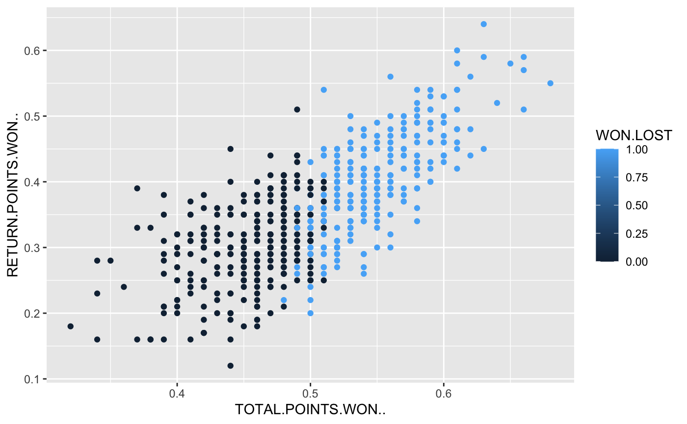
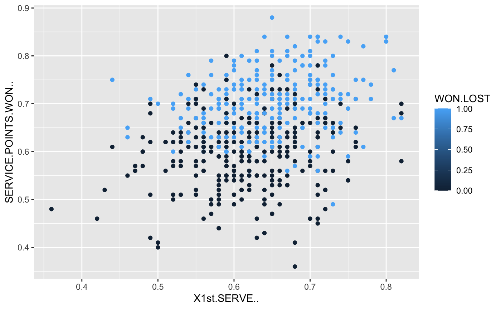
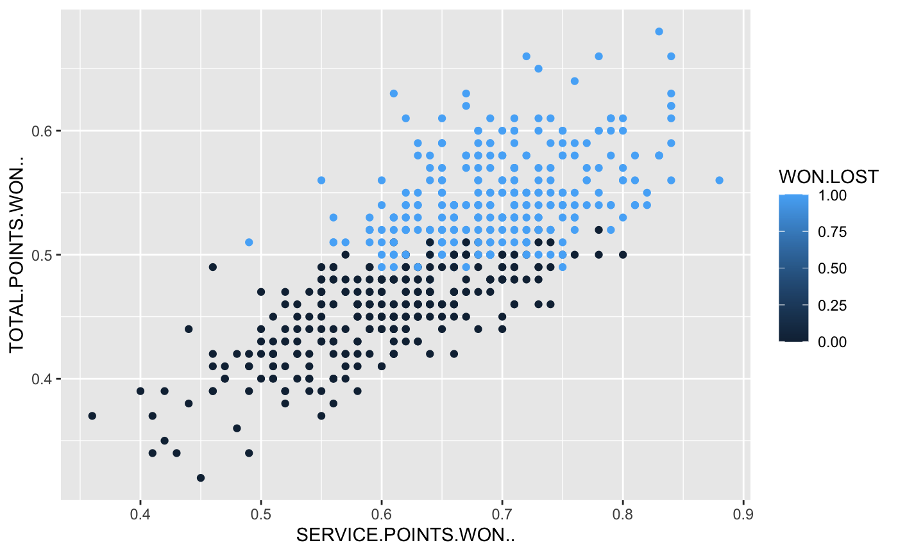
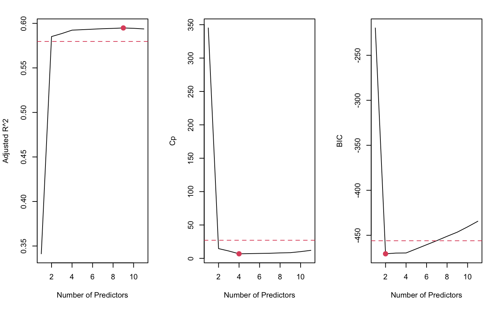
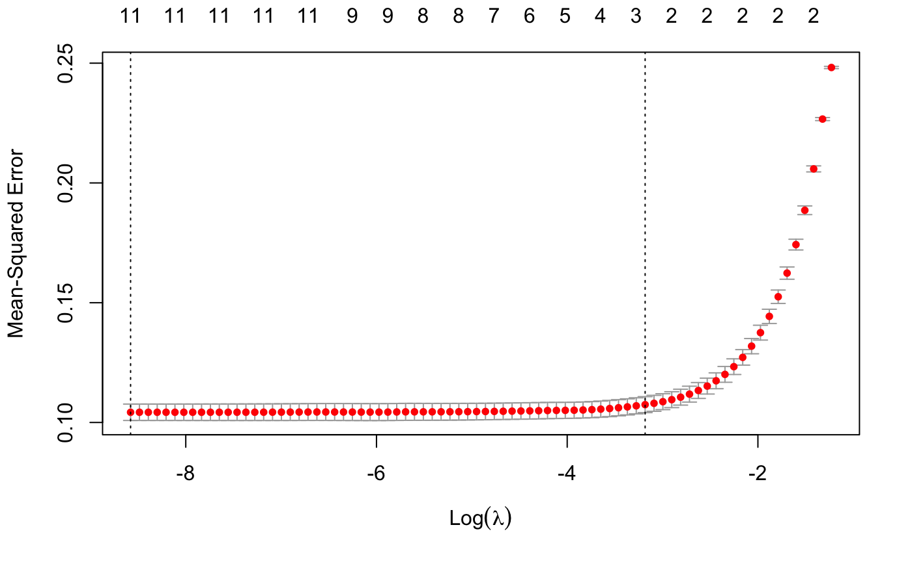

# Tennis-match-winner-prediction

In this project, I built a scraper to scrape tennis match statistics from atptour.com, and then a tool that uses the statistics to predict the winner of a tennis match and in doing so identifies which variable was of most importance in the prediction of the winner.

### EDA

Some basic EDA to see how varibales relate to eachother

  
   

 

### Variable Selection

Here I performed **Best Subset Selection** and use BIC, Adj-R2 and Cp to evaluate the models based on the number of variables

Also performed Lasso using CV to pick the best $\lambda$ value and see what how many and which variables were picked in this case

Ended up being between a 4 to 7 variable model.

### Model Fitting & Evaluation
